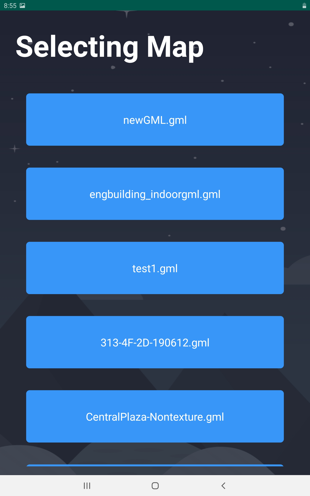

 

    
  </a>

  <h3 align="center">SHIMA</h3>
  

   Sound haptic indoor map application for blind people
  

## Description
This application gives an abstract view of the inside of building including the locations of rooms, and other things in the building. Please keep in mind that it is not a navigation application. It makes a bunch of different reactions when a person touches an obstacle in the map, depending on the type of obstacle. The appropriate reactions for every obstacle are listed below. To trigger a reaction you should double tap an appropriate button an keep on it.

## UI

